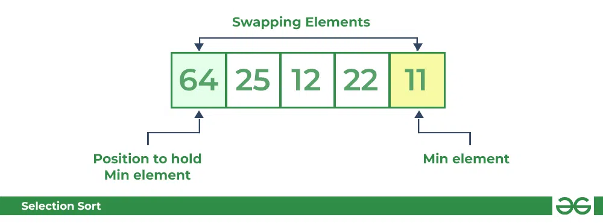
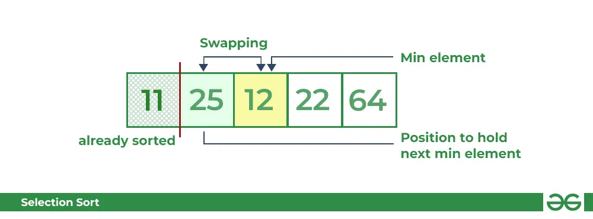
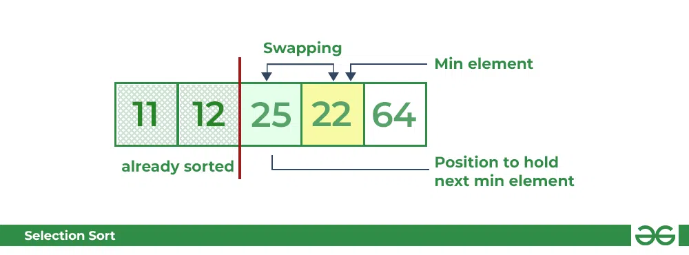
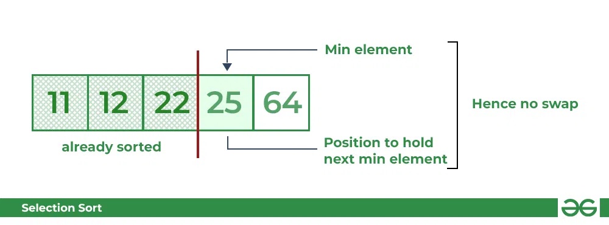
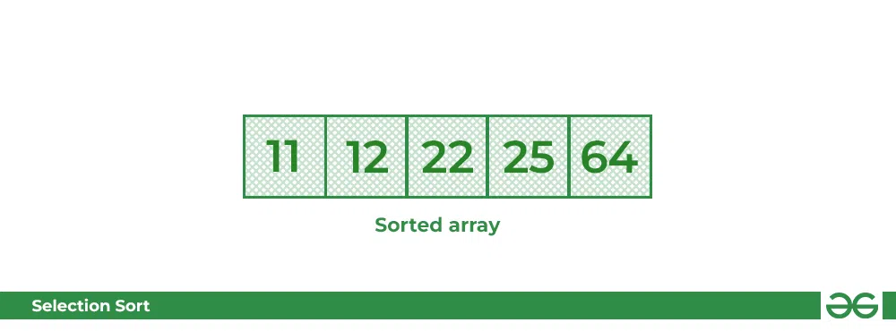

# Selection Sort

sıralama algoritmalarından biridir. Bu algoritma, sıralanmamış bir dizinin her adımda en küçük (veya en büyük) elemanını bulup, bu elemanı dizinin uygun konumuna yerleştirerek sıralama işlemini gerçekleştirir. Seçim sıralaması, basit bir yapısı olmasına rağmen performans açısından etkili değildir ve genellikle küçük veri setlerinde kullanılır.

Selection Sort algoritmasının adım adım çalışma şekli şu şekildedir:
- First Pass

- Second Pass

- Third Pass

- Four Pass

- Five Pass

**Dış Döngü:**

Dizi boyunca bir dış döngü başlatılır. Döngü, dizinin başından başlayarak bir eleman seçmek için kullanılır.
Minimum (veya Maksimum) Bulma:

Dış döngü içinde, seçim işlemi için bir minimum (veya maksimum) değer ve bu değerin dizideki konumu için bir indeks tutulur.
Döngü içindeki her eleman, şu anki minimum değeri karşılaştırarak daha küçük (veya büyük) bir değer bulunursa, minimum değeri ve indeksi güncellenir.
Değişim:

Dış döngü içinde en küçük (veya en büyük) eleman bulunduğunda, bu eleman ile dizinin şu anki konumundaki elemanın yerini değiştirilir.

**Döngü İterasyonu:**

Dış döngü devam eder ve sıralanmış kısmın bir eleman daha eklenir.
Sıralama Tamamlanana Kadar Devam:

Dış döngü, dizideki tüm elemanlar sıralanana kadar devam eder.
Selection Sort, zaman karmaşıklığı açısından O(n^2) olarak kabul edilir. Bu nedenle, büyük veri setlerinde etkili olmayabilir. Ancak, algoritmanın yer değiştirme işlemi nedeniyle ekstra bellek kullanımına ihtiyaç duymaz. Selection Sort, öğrenme amaçlı veya küçük veri setleri üzerinde basit bir sıralama algoritması olarak kullanılabilir.

## Stable And Unstable Sort

Stable ve unstable sort algoritmaları, sıralama işlemlerinin nasıl gerçekleştirildiğine ve özellikle elemanların eşit olduğu durumlarda sıralama stabilitesine (stable) dikkat edip etmediklerine bağlı olarak farklılık gösterir.

**Stable (Kararlı) Sıralama:**

Stable sıralama algoritmaları, eşit öğelerin sırasını korur. Yani, sıralama işlemi sonucunda önce gelen eşit öğelerin orijinal sıralamadaki göreceli pozisyonları aynı kalır.
Örneğin, aynı anahtara sahip iki öğe A ve B varsa, ve A'nın orijinal konumu B'den önceyse, stable sıralama algoritmaları sonucunda A hala B'den önce olacaktır.

**Unstable (Kararsız) Sıralama:**

Unstable sıralama algoritmaları, eşit öğelerin orijinal sırasını korumak zorunda değiller. Yani, aynı anahtara sahip iki öğe arasındaki göreceli sıralama orijinal sıradan farklı olabilir.
Eğer A ve B aynı anahtara sahipse ve A orijinal sıradaki B'den önceyse, unstable sıralama algoritmaları sonucunda A ve B'nin sıralamadaki konumları değişebilir.
Örnek bir durumu ele alalım:

Orijinal Dizi: (3A, 2, 3B, 1, 3C)

Bu diziyi stabil ve kararsız sıralama algoritmalarıyla sıraladığımızı düşünelim, burada "3A", "3B", ve "3C" eşit anahtarlara sahip öğelerdir.

- Stable Sıralama:

Sıralama sonucu: (1, 2, 3A, 3B, 3C)
"3A", "3B", ve "3C" sıralama sırasında orijinal konumlarını korur.

- Unstable Sıralama:

Sıralama sonucu: (1, 2, 3C, 3B, 3A)
"3A", "3B", ve "3C" sıralama sonucunda orijinal konumlarını korumayabilir.

**Stable sıralama algoritmaları genellikle insertion sort, bubble sort ve merge sort gibi algoritmaları içerirken, quicksort ve heapsort gibi algoritmalar genellikle unstable sıralama olarak kabul edilir. Ancak, sıralama algoritmalarının implementasyonlarına bağlı olarak bu durum değişebilir.**

- O(n²) time complexity
- In-place alogrithm
- Unstable Algorithm